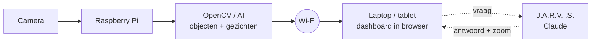

# SlimmeDrone

Een drone-camera met gezichtsherkenning, objectherkenning en een slimme AI-assistent,
plus een beveiligde website (grondstation) om live mee te kijken.

Schoolproject van **Johan** (software & AI), **Jaiden** (hardware & drone) en
**Safouan** (dashboard & communicatie).

## Wat kan het?

- **Live camerabeeld** in de browser, met kaders om alles wat herkend wordt.
- **Objectherkenning**: weet wat een persoon, hond, tafel, auto, fles... is (80 soorten).
- **Gezichtsherkenning**: jullie voegen zelf gezichten toe via de website; bekende
  mensen krijgen een groen kader met hun naam, onbekende een rood kader.
- **Meldingen** zodra iemand herkend wordt of er een onbekend gezicht verschijnt
  (ook opgeslagen in `data/meldingen.csv`).
- **J.A.R.V.I.S.**: rechts op het dashboard een chat. Vraag "wat zie je?",
  "wie is er in beeld?" of "zoom in op de tafel" en hij doet het. Hij kan antwoorden
  ook voorlezen.
- **Digitale zoom** die een object blijft volgen; of klik gewoon in het beeld.
- **Inlogpagina**, zodat niet zomaar iedereen kan meekijken.

## Hoe werkt het?



Er zijn twee manieren om het te draaien:

| | Optie A: alles op de Pi | Optie B: Pi stuurt alleen beeld |
|---|---|---|
| Op de Raspberry Pi | `python app.py` | `python pi_stream.py` |
| Op de laptop | browser naar `http://<ip-van-pi>:5000` | `python app.py` met `CAMERA_SOURCE=http://<ip-van-pi>:8000/stream.mjpg?token=...` |
| Voordeel | Precies zoals in het ontwerp | Sneller, de laptop doet het zware AI-werk |

Je kunt alles ook gewoon op een laptop met webcam testen, zonder drone.

### Welke AI zit erin?

| Onderdeel | Model | Waar het draait |
|---|---|---|
| Gezichten vinden | YuNet (OpenCV Model Zoo) | lokaal |
| Gezichten herkennen | SFace (OpenCV Model Zoo) | lokaal |
| Objecten herkennen | YOLO11 (Ultralytics) of YOLOX (OpenCV Model Zoo) | lokaal |
| Assistent J.A.R.V.I.S. | Claude (Anthropic), met een eenvoudige offline versie als terugval | internet (Claude) of lokaal |

De modellen worden de eerste keer automatisch gedownload naar `data/models/`.

**Hoe gezichtsherkenning werkt:** SFace maakt van elk gezicht een "vingerafdruk" van
128 getallen. Twee foto's van dezelfde persoon geven vingerafdrukken die op elkaar
lijken. Is de overeenkomst met een opgeslagen gezicht hoger dan
`FACE_MATCH_THRESHOLD` (0,363), dan is het die persoon.

## Installeren op een laptop (Windows)

1. Installeer [Python 3.12](https://www.python.org/downloads/) (vink *Add Python to PATH* aan)
   en [Git](https://git-scm.com/download/win).
2. Open een terminal (PowerShell) en voer uit:

```bash
git clone https://github.com/Phoenix232323/slimmedrone.git
```

```bash
cd slimmedrone
```

```bash
python -m venv .venv
```

```bash
.venv\Scripts\activate
```

```bash
pip install -r requirements.txt
```

```bash
copy .env.example .env
```

3. Maak een gebruiker aan (je typt het wachtwoord twee keer, minstens 8 tekens):

```bash
python beheer.py gebruiker-toevoegen johan
```

4. Start het grondstation:

```bash
python app.py
```

5. Open `http://localhost:5000` en log in. Op andere apparaten in hetzelfde wifi-netwerk
   gebruik je het adres dat in de terminal verschijnt (bijv. `http://192.168.1.23:5000`).

Op macOS/Linux gebruik je `source .venv/bin/activate` en `cp .env.example .env`.

## Installeren op de Raspberry Pi

Gebruik Raspberry Pi OS (64-bit) op een Pi 4 of 5 met een cameramodule.
(Pi 5 en Pi Zero hebben een kleinere camera-aansluiting: gebruik de *Standard-Mini* kabel.)

1. Haal de code op de Pi: open in de browser van de Pi deze GitHub-pagina, klik op de
   groene knop **Code** en dan **Download ZIP**, en pak het zip-bestand uit
   (rechtermuisklik, *Extract Here*). Of in de terminal:

```bash
git clone https://github.com/Phoenix232323/slimmedrone.git
```

2. Open een terminal in die map (in Bestandsbeheer: **F4**, of via *Tools* >
   *Open Current Folder in Terminal*) en installeer alles in één keer:

```bash
bash install-pi.sh
```

   Het script installeert de pakketten, zet de camera op `picamera`, downloadt de
   AI-modellen en vraagt je om een gebruikersnaam en wachtwoord voor de website.

3. Starten (ook de volgende keren):

```bash
bash start.sh
```

Is de Pi te traag, gebruik dan optie B (`pi_stream.py`).

Werkt de camera niet? Test hem eerst los met `rpicam-hello --list-cameras`.

Handmatig installeren kan ook: maak de venv met `--system-site-packages` en gebruik
`requirements-pi.txt` (niet `requirements.txt`). Nieuwere OpenCV-versies vervangen
anders de numpy van het systeem, en dan werkt `picamera2` niet meer.

## Gezichten toevoegen

Ga op de website naar **Gezichten**, vul een naam in en:

- klik **Neem foto van het gezicht in beeld** (er mag maar één gezicht te zien zijn;
  zijn er meer, zoom dan eerst in op het juiste gezicht), of
- **upload foto's** (één persoon per foto).

Voeg 3 tot 5 foto's per persoon toe, uit verschillende hoeken en met ander licht.
Dat kan ook vanaf de terminal:

```bash
python beheer.py gezicht-toevoegen "Johan" foto1.jpg foto2.jpg
```

## J.A.R.V.I.S. (de slimme assistent)

Zonder instellingen werkt een **lokale versie** die eenvoudige vragen begrijpt:
*wat zie je, wie is er, hoeveel personen, zie je een hond, zoom in op de tafel,
zoom in op Johan, zoom uit*.

Voor de **echte slimme versie** gebruik je Claude:

1. Maak een API-sleutel op [console.anthropic.com](https://console.anthropic.com)
   (hier zijn kosten aan verbonden; stel een maandlimiet in).
2. Zet de sleutel in `.env`: `ANTHROPIC_API_KEY=sk-ant-...`
3. Start `app.py` opnieuw. Rechtsboven staat dan **Claude**.

Claude krijgt bij elke vraag het camerabeeld en de resultaten van de objecten- en
gezichtsherkenning. Hij kan zelf in- en uitzoomen en kijkt na het inzoomen naar het
ingezoomde beeld, dus "zoom in op de tafel en vertel wat erop ligt" werkt.
Namen haalt hij alleen uit jullie eigen gezichtsherkenning; hij herkent zelf niemand.

- `CLAUDE_EFFORT=low` is snel en goedkoop; `medium` of `high` denkt langer na.
- De **luidspreker-knop** leest antwoorden voor.
- De **microfoon-knop** verschijnt alleen via `localhost` of `https`
  (browsers staan de microfoon anders niet toe).

## Instellingen (`.env`)

| Instelling | Standaard | Uitleg |
|---|---|---|
| `CAMERA_SOURCE` | `0` | `0` = webcam, `picamera`, een stream-URL, of een video/foto om te testen |
| `PROCESS_WIDTH` | `960` | beeldbreedte voor de AI (kleiner = sneller) |
| `OBJECT_BACKEND` | `auto` | `yolo`, `opencv` of `uit` |
| `OBJECT_EVERY` | `1` | alleen elk N-de beeld objecten zoeken |
| `FACE_MATCH_THRESHOLD` | `0.363` | hoger = strenger herkennen |
| `ALERT_COOLDOWN` | `30` | seconden tussen meldingen over dezelfde persoon |
| `PORT` | `5000` | poort van de website |
| `ANTHROPIC_API_KEY` | leeg | sleutel voor Claude |
| `CLAUDE_MODEL` | `claude-opus-5-5` | welk Claude-model |
| `STREAM_TOKEN` | leeg | wachtwoord voor `pi_stream.py` |

Zie `.env.example` voor alle opties.

## Projectstructuur

```
app.py               start het grondstation (website + AI)
beheer.py            gebruikers en gezichten beheren vanaf de terminal
pi_stream.py         alleen camerabeeld doorsturen vanaf de Pi (optie B)
install-pi.sh        alles installeren op de Raspberry Pi
start.sh             de SlimmeDrone starten op de Raspberry Pi
slimmedrone/
  camera.py          camerabronnen (webcam, Pi-camera, stream, testbestand)
  objects.py         objectherkenning (YOLO11 / YOLOX)
  faces.py           gezichtsherkenning + database met gezichten
  pipeline.py        verwerkingslus: beeld -> AI -> tekenen -> zoom -> stream
  zoom.py            digitale zoom die objecten volgt
  alerts.py          meldingen
  assistant.py       J.A.R.V.I.S. (Claude + offline versie)
  auth.py            gebruikers en wachtwoorden
  web.py             de website en API (Flask)
  labels.py          Nederlandse namen van de 80 objectsoorten
templates/, static/  HTML, CSS en JavaScript van de website
data/                gebruikers, gezichten, modellen, meldingen (staat NIET op GitHub)
```

## Privacy en veiligheid

- Voeg alleen gezichten toe van mensen die daar **toestemming** voor geven (AVG).
- De map `data/` (wachtwoorden, gezichten, meldingen) en `.env` (API-sleutel) staan
  in `.gitignore` en komen dus **niet** op GitHub.
- Wachtwoorden worden alleen als hash opgeslagen. Na 5 foute pogingen moet je 5 minuten wachten.
- De website gebruikt gewoon `http`, dus het verkeer is niet versleuteld. Gebruik hem
  alleen op je eigen (wifi-)netwerk en niet via het internet.
- Het systeem is een prototype voor **observatie**: het detecteert en meldt, en bevat
  geen wapens, aanvalssystemen of autonome ingrepen.

## Problemen oplossen

- **"YOLO/PyTorch werkt niet"**: geen probleem, de software gebruikt dan YOLOX via
  OpenCV. Op sommige Windows-pc's blokkeert *Slim app-beheer* PyTorch. Wil je YOLO11
  op een computer waar het wel werkt: `pip install ultralytics`.
- **"Geen camerabeeld"**: controleer `CAMERA_SOURCE`. Probeer `0` of `1` voor een webcam.
  Sluit andere programma's die de camera gebruiken (Teams, Zoom).
- **Traag**: verlaag `PROCESS_WIDTH` (bijv. 640) en verhoog `OBJECT_EVERY` (bijv. 3).
- **Gezicht wordt niet herkend**: voeg meer foto's toe, of verlaag `FACE_MATCH_THRESHOLD` iets (bijv. 0.33).
- **Andere apparaten kunnen de website niet openen**: sta Python toe in de Windows-firewall
  en controleer of alles op hetzelfde wifi-netwerk zit.

## Licenties van de modellen

YuNet, SFace en YOLOX komen uit de [OpenCV Model Zoo](https://github.com/opencv/opencv_zoo)
(Apache 2.0). YOLO11 is van [Ultralytics](https://github.com/ultralytics/ultralytics) (AGPL-3.0, optioneel).
