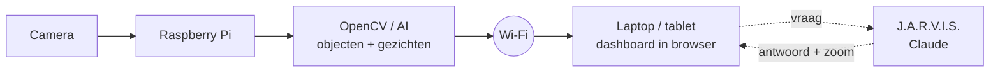

# SlimmeDrone

Een drone-camera met gezichtsherkenning, objectherkenning en een slimme AI-assistent,
plus een beveiligde website (grondstation) om live mee te kijken.

Schoolproject van **Johan** (software & AI), **Jaiden** (hardware & drone) en
**Safouan** (dashboard & communicatie).

## Wat kan het?

- **Live camerabeeld** in de browser, vloeiend op 30 beelden per seconde, met kaders om
  alles wat herkend wordt en een HUD (vizier, fps, zoom) eroverheen.
- **Objectherkenning**: weet wat een persoon, hond, tafel, auto, fles... is (80 soorten).
  Met de **Raspberry Pi AI Camera** (IMX500) doet de camera dat zelf, zodat de Pi
  rekenkracht overhoudt.
- **Gezichtsherkenning**: jullie voegen zelf gezichten toe via de website; bekende
  mensen krijgen een groen kader met hun naam, onbekende een rood kader.
- **Meldingen** zodra iemand herkend wordt of er een onbekend gezicht verschijnt
  (ook opgeslagen in `data/meldingen.csv`).
- **J.A.R.V.I.S.**: rechts op het dashboard een chat, net zo slim als ChatGPT of Copilot
  (met een Claude-sleutel). Antwoorden komen woord voor woord binnen. Vraag "wat zie je?",
  "zoom in op de tafel", "maak een foto", "waarschuw me als er een hond komt" of
  "wat voor weer wordt het?" (hij kan op internet zoeken). Hij kan antwoorden voorlezen
  en je kunt hem ook inspreken ("Jarvis, wat zie je?").
- **Wachters en activiteit**: J.A.R.V.I.S. let voor je op iets en meldt wat er
  verscheen of verdween.
- **Instellingen op de website**: Claude-sleutel, denkniveau, internet zoeken, spraak.
- **Digitale zoom** die een object blijft volgen; of klik gewoon in het beeld.
- **Inlogpagina**, zodat niet zomaar iedereen kan meekijken.

## Hoe werkt het?



Er zijn twee manieren om het te draaien:

| | Optie A: alles op de Pi | Optie B: Pi stuurt alleen beeld |
|---|---|---|
| Op de Raspberry Pi | `python app.py` | `python pi_stream.py` |
| Op de laptop | browser naar `http://<ip-van-pi>:5000` | `python app.py` met `CAMERA_SOURCE=http://<ip-van-pi>:8000/stream.mjpg?token=...` |
| Voordeel | Precies zoals in het ontwerp | Sneller, de laptop doet het zware AI-werk |

Je kunt alles ook gewoon op een laptop met webcam testen, zonder drone.

### Welke AI zit erin?

| Onderdeel | Model | Waar het draait |
|---|---|---|
| Gezichten vinden | YuNet (OpenCV Model Zoo) | lokaal |
| Gezichten herkennen | SFace (OpenCV Model Zoo) | lokaal |
| Objecten herkennen | SSD MobileNetV2 in de AI Camera (IMX500), of YOLO11 (Ultralytics) / YOLOX (OpenCV Model Zoo) op de processor | in de camera of lokaal |
| Assistent J.A.R.V.I.S. | Claude (Anthropic), met internet zoeken, en een lokale versie als terugval | internet (Claude) of lokaal |

De modellen worden de eerste keer automatisch gedownload naar `data/models/`
(het AI Camera-model komt uit het pakket `imx500-all`).

**Waarom het beeld vloeiend blijft:** de camera leest in een eigen thread. De
verwerkingslus tekent elk beeld en maakt er een JPEG van. Gezichtsherkenning en YOLO
draaien elk in een eigen thread op het nieuwste beeld, zodat het beeld nooit op de AI
hoeft te wachten (de kaders lopen soms een fractie achter). Met de AI Camera komen de
objecten bij elk beeld uit de camera zelf. Kijkt niemand mee, dan maakt hij maar 2
JPEG-beelden per seconde; herkenning en meldingen gaan gewoon door.

**Hoe gezichtsherkenning werkt:** SFace maakt van elk gezicht een "vingerafdruk" van
128 getallen. Twee foto's van dezelfde persoon geven vingerafdrukken die op elkaar
lijken. Is de overeenkomst met een opgeslagen gezicht hoger dan
`FACE_MATCH_THRESHOLD` (0,363), dan is het die persoon.

## Installeren op een laptop (Windows)

1. Installeer [Python 3.12](https://www.python.org/downloads/) (vink *Add Python to PATH* aan)
   en [Git](https://git-scm.com/download/win).
2. Open een terminal (PowerShell) en voer uit:

```bash
git clone https://github.com/Phoenix232323/slimmedrone.git
```

```bash
cd slimmedrone
```

```bash
python -m venv .venv
```

```bash
.venv\Scripts\activate
```

```bash
pip install -r requirements.txt
```

```bash
copy .env.example .env
```

3. Maak een gebruiker aan (je typt het wachtwoord twee keer, minstens 8 tekens):

```bash
python beheer.py gebruiker-toevoegen johan
```

4. Start het grondstation:

```bash
python app.py
```

5. Open `http://localhost:5000` en log in. Op andere apparaten in hetzelfde wifi-netwerk
   gebruik je het adres dat in de terminal verschijnt (bijv. `http://192.168.1.23:5000`).

Op macOS/Linux gebruik je `source .venv/bin/activate` en `cp .env.example .env`.

## Installeren op de Raspberry Pi

Gebruik Raspberry Pi OS (64-bit) op een Pi 4 of 5 met een cameramodule.
(Pi 5 en Pi Zero hebben een kleinere camera-aansluiting: gebruik de *Standard-Mini* kabel.)

1. Haal de code op de Pi: open in de browser van de Pi deze GitHub-pagina, klik op de
   groene knop **Code** en dan **Download ZIP**, en pak het zip-bestand uit
   (rechtermuisklik, *Extract Here*). Of in de terminal:

```bash
git clone https://github.com/Phoenix232323/slimmedrone.git
```

2. Open een terminal in die map (in Bestandsbeheer: **F4**, of via *Tools* >
   *Open Current Folder in Terminal*) en installeer alles in één keer:

```bash
bash install-pi.sh
```

   Het script installeert de pakketten, zet de camera op `picamera`, downloadt de
   AI-modellen en vraagt je om een gebruikersnaam en wachtwoord voor de website.

3. Starten (ook de volgende keren):

```bash
bash start.sh
```

Is de Pi te traag, gebruik dan optie B (`pi_stream.py`). Kijk ook liever vanaf je
laptop of telefoon mee: de browser op de Pi zelf kost ook rekenkracht.

### Bijwerken naar een nieuwe versie

Stop de SlimmeDrone (**Ctrl+C**) en typ in de map van het project:

```bash
git pull
```

```bash
bash install-pi.sh
```

```bash
bash start.sh
```

`install-pi.sh` mag je gerust opnieuw draaien: het slaat over wat al klaar is, zet een
oude `STREAM_FPS=20` op 30 en installeert de software voor de AI Camera. Vraagt het
script om de Pi te herstarten, doe dat dan één keer met `sudo reboot`.

### De Raspberry Pi AI Camera (IMX500)

- `bash install-pi.sh` ziet de AI Camera zelf en installeert `imx500-all` (firmware en
  modellen). Herstart de Pi daarna één keer (`sudo reboot`). Handmatig kan ook:
  `sudo apt install -y imx500-all`.
- Met `CAMERA_SOURCE=picamera` en `OBJECT_BACKEND=auto` gebruikt de SlimmeDrone de AI
  Camera vanzelf. In de terminal zie je "Objectherkenning: AI Camera (IMX500, in de
  camera)" en even later "objectherkenning in de camera werkt". De eerste keer laden
  kan even duren.
- **De AI Camera kan maximaal 30 beelden per seconde** (stand 2028x1520). 60 fps kan
  alleen met een camera die dat echt kan (bijv. Camera Module 3 of een snelle
  USB-webcam): zet dan `CAMERA_FPS=60` en `STREAM_FPS=60`.
- Gaat er iets mis (model niet gevonden, oude software, rare uitvoer), dan staat er één
  regel in de terminal met de oplossing, en gaat de objectherkenning gewoon verder op de
  processor (YOLOX).

Werkt de camera niet? Test hem eerst los met `rpicam-hello --list-cameras`.

Handmatig installeren kan ook: maak de venv met `--system-site-packages` en gebruik
`requirements-pi.txt` (niet `requirements.txt`). Nieuwere OpenCV-versies vervangen
anders de numpy van het systeem, en dan werkt `picamera2` niet meer.

## Gezichten toevoegen

Ga op de website naar **Gezichten**, vul een naam in en:

- klik **Neem foto van het gezicht in beeld** (er mag maar één gezicht te zien zijn;
  zijn er meer, zoom dan eerst in op het juiste gezicht), of
- **upload foto's** (één persoon per foto).

Voeg 3 tot 5 foto's per persoon toe, uit verschillende hoeken en met ander licht.
Dat kan ook vanaf de terminal:

```bash
python beheer.py gezicht-toevoegen "Johan" foto1.jpg foto2.jpg
```

## De website

Er zijn drie pagina's: **Live**, **Gezichten** en **Instellingen**.

- **Live**: het camerabeeld met HUD (klik in het beeld om in te zoomen), knoppen voor
  zoomen, foto opslaan en volledig scherm, telemetrie (fps, CPU-temperatuur, belasting,
  geheugen), en panelen voor objecten (klik = inzoomen), gezichten, meldingen (met
  filter), activiteit en wachters.
- **Telefoon**: onderaan een tabbalk (Live / J.A.R.V.I.S. / Meldingen / Meer).
  Je kunt de site op je beginscherm zetten.
- **Sneltoetsen** op de computer: `?` hulp, `/` typen, `f` volledig scherm, `s` foto,
  `z` zoom uit, `m` microfoon.

## J.A.R.V.I.S. (de slimme assistent)

Zonder sleutel werkt een **lokale versie** die veel Nederlandse zinnen begrijpt:
*wat zie je, wie is er, hoeveel personen, zoom in op de tafel, zoom uit, hoe laat is
het, hoe warm is de Pi, wat is er gebeurd, wie ken je, maak een foto, waarschuw me als
er een hond komt, waar let je op*. Zeg "help" voor een overzicht.

Voor de **echte slimme versie** (net zo slim als ChatGPT of Copilot) gebruikt hij
Claude van Anthropic:

1. Maak een account op [console.anthropic.com](https://console.anthropic.com), koop wat
   tegoed (Plans & Billing) en stel een maandlimiet in. Je betaalt per vraag; een gewone
   vraag kost meestal een paar cent.
2. Maak bij **API Keys** een sleutel (begint met `sk-ant-`).
3. Plak hem op de website bij **Instellingen** en klik **Opslaan**. Herstarten is niet
   nodig. (In `.env` als `ANTHROPIC_API_KEY=...` kan ook; de website gaat voor.)

Wat hij dan kan:

- Antwoorden komen woord voor woord binnen. Je ziet wat hij doet ("Ik zoom in op de
  tafel..."), ingezoomde beelden en foto's verschijnen in de chat.
- **Internet zoeken** (weer, nieuws, feiten), met de bronnen eronder. Elke zoekopdracht
  kost een klein beetje extra; uitzetten kan bij Instellingen of met `JARVIS_WEB=uit`.
  Met `JARVIS_PLAATS=Utrecht` weet hij voor welke plaats hij het weer zoekt.
- Zelf in- en uitzoomen en daarna naar het ingezoomde beeld kijken, dus "zoom in op de
  tafel en vertel wat erop ligt" werkt.
- **Foto's maken** (komen in `data/fotos/`), meldingen en activiteit opvragen ("wat is
  er de laatste 10 minuten gebeurd?"), de Pi controleren (temperatuur, fps).
- **Wachters**: "waarschuw me als er een hond komt", "laat het weten als Johan in beeld
  komt", "let op onbekende gezichten". Standaard een uur; "de komende 10 minuten" kan
  ook. Gaat hij af, dan komt er een melding met een fotootje.
- **Denkniveau** bij Instellingen: *Snel* (low) is snel en goedkoop, *Normaal* en
  *Grondig* denken langer na.

Hij kijkt alleen mee en grijpt nergens in. Namen haalt hij alleen uit jullie eigen
gezichtsherkenning; hij herkent zelf niemand, en onbekende gezichten blijven onbekend.

### Spraak

- De **microfoonknop**: kort klikken = luisteren tot je klaar bent, ingedrukt houden =
  praten zolang je drukt. Met het **wekwoord** aan zeg je "Jarvis, wat zie je?".
- De **luidspreker-knop** leest antwoorden voor (stem en tempo kies je bij Instellingen).
  Je kunt ook nieuwe meldingen laten uitspreken of een piepje laten geven.
- Browsers staan de microfoon alleen toe via **https** of op de Pi zelf
  (`http://localhost:5000`). Zet daarom `HTTPS=aan` in `.env` en start opnieuw. Het adres
  wordt dan `https://<ip-van-pi>:5000`. De browser waarschuwt de eerste keer voor het
  eigen certificaat: kies "Geavanceerd" en dan "Doorgaan".
- Chromium op de Raspberry Pi heeft vaak geen spraakherkenning. Gebruik voor inspreken
  Chrome of Edge op een laptop of Android-telefoon.

## Instellingen (`.env`)

| Instelling | Standaard | Uitleg |
|---|---|---|
| `CAMERA_SOURCE` | `0` | `0` = webcam, `picamera`, een stream-URL, of een video/foto om te testen |
| `CAMERA_FPS` | `30` | beelden per seconde van de camera (AI Camera: max 30; 60 alleen als de camera het kan) |
| `PROCESS_WIDTH` | `960` | beeldbreedte voor de AI (kleiner = sneller) |
| `OBJECT_BACKEND` | `auto` | `imx500` (AI Camera), `yolo`, `opencv` of `uit`; auto kiest de AI Camera als die er is |
| `IMX500_MODEL` | leeg | ander model voor de AI Camera (leeg = SSD MobileNetV2 uit imx500-all) |
| `OBJECT_EVERY` | `1` | na elke YOLO-ronde eerst N nieuwe beelden afwachten (geldt niet voor de AI Camera) |
| `FACE_MATCH_THRESHOLD` | `0.363` | hoger = strenger herkennen |
| `ALERT_COOLDOWN` | `30` | seconden tussen meldingen over dezelfde persoon |
| `PORT` | `5000` | poort van de website |
| `STREAM_FPS` | `30` | maximaal aantal beelden per seconde naar de browser |
| `HTTPS` | `uit` | `aan` = https met een eigen certificaat (nodig voor de microfoon) |
| `ANTHROPIC_API_KEY` | leeg | sleutel voor Claude (makkelijker: pagina Instellingen) |
| `CLAUDE_MODEL` | `claude-opus-5-5` | welk Claude-model |
| `CLAUDE_EFFORT` | `low` | denkniveau: `low`, `medium` of `high` |
| `JARVIS_WEB` | `aan` | mag J.A.R.V.I.S. op internet zoeken |
| `JARVIS_PLAATS` | leeg | plaats voor het weer en lokaal nieuws |
| `JARVIS_AI` | `auto` | `uit` = altijd de lokale versie |
| `STREAM_TOKEN` | leeg | wachtwoord voor `pi_stream.py` |

Zie `.env.example` voor alle opties.

## Projectstructuur

```
app.py               start het grondstation (website + AI)
beheer.py            gebruikers en gezichten beheren vanaf de terminal
pi_stream.py         alleen camerabeeld doorsturen vanaf de Pi (optie B)
install-pi.sh        alles installeren op de Raspberry Pi
start.sh             de SlimmeDrone starten op de Raspberry Pi
slimmedrone/
  camera.py          camerabronnen (webcam, Pi-camera, stream, testbestand)
  imx500.py          de Raspberry Pi AI Camera: objectherkenning in de camera zelf
  objects.py         objectherkenning (AI Camera / YOLO11 / YOLOX)
  faces.py           gezichtsherkenning + database met gezichten
  pipeline.py        verwerkingslus: beeld -> AI -> tekenen -> zoom -> stream
  zoom.py            digitale zoom die objecten volgt
  alerts.py          meldingen
  assistant.py       J.A.R.V.I.S. (Claude + lokale versie)
  activity.py        wat er verscheen en verdween, wachters
  settings.py        instellingen van de website (o.a. de Claude-sleutel)
  system.py          gezondheid van de Pi (temperatuur, belasting, geheugen)
  auth.py            gebruikers en wachtwoorden
  web.py             de website en API (Flask)
  labels.py          Nederlandse namen van de 80 objectsoorten
templates/, static/  HTML, CSS en JavaScript van de website
data/                gebruikers, gezichten, modellen, meldingen, foto's, instellingen,
                     certificaat (staat NIET op GitHub)
```

## Privacy en veiligheid

- Voeg alleen gezichten toe van mensen die daar **toestemming** voor geven (AVG).
- De map `data/` (wachtwoorden, gezichten, meldingen, foto's, de Claude-sleutel in
  `instellingen.json`) en `.env` staan in `.gitignore` en komen dus **niet** op GitHub.
  De website toont de sleutel nooit meer volledig, alleen de laatste 4 tekens.
- Wachtwoorden worden alleen als hash opgeslagen. Na 5 foute pogingen moet je 5 minuten wachten.
- Standaard gebruikt de website gewoon `http`, dus het verkeer is niet versleuteld. Met
  `HTTPS=aan` wel (met een eigen certificaat). Gebruik hem alleen op je eigen
  (wifi-)netwerk en niet via het internet.
- Het systeem is een prototype voor **observatie**: het detecteert en meldt, en bevat
  geen wapens, aanvalssystemen of autonome ingrepen.

## Problemen oplossen

- **"YOLO/PyTorch werkt niet"**: geen probleem, de software gebruikt dan YOLOX via
  OpenCV. Op sommige Windows-pc's blokkeert *Slim app-beheer* PyTorch. Wil je YOLO11
  op een computer waar het wel werkt: `pip install ultralytics`.
- **"Geen camerabeeld"**: controleer `CAMERA_SOURCE`. Probeer `0` of `1` voor een webcam.
  Sluit andere programma's die de camera gebruiken (Teams, Zoom).
- **"AI Camera werkt niet: het model ... bestaat niet"**: `sudo apt install -y imx500-all`
  en herstart de Pi één keer.
- **"AI Camera-onderdelen van picamera2 ontbreken"**:
  `sudo apt update && sudo apt full-upgrade -y && sudo apt install -y imx500-all`.
- **"Deze camera kan maximaal 30 beelden per seconde"**: normaal bij de AI Camera.
- **J.A.R.V.I.S. zegt dat er geen tegoed is**: koop tegoed op console.anthropic.com
  (Plans & Billing). Zonder internet antwoordt hij even met de lokale versie.
- **Microfoonknop werkt niet**: zie Spraak hierboven (`HTTPS=aan`).
- **Traag**: zonder AI Camera helpt `PROCESS_WIDTH=640` en `OBJECT_EVERY=3`.
  Kijk op een Raspberry Pi liever vanaf een laptop of telefoon mee: de browser op de Pi zelf
  kost ook rekenkracht. De objectkaders lopen soms iets achter op het beeld; dat is normaal,
  de objectherkenning draait apart zodat de livestream er niet op hoeft te wachten.
- **Gezicht wordt niet herkend**: voeg meer foto's toe, of verlaag `FACE_MATCH_THRESHOLD` iets (bijv. 0.33).
- **Andere apparaten kunnen de website niet openen**: sta Python toe in de Windows-firewall
  en controleer of alles op hetzelfde wifi-netwerk zit.

## Licenties van de modellen

YuNet, SFace en YOLOX komen uit de [OpenCV Model Zoo](https://github.com/opencv/opencv_zoo)
(Apache 2.0). YOLO11 is van [Ultralytics](https://github.com/ultralytics/ultralytics) (AGPL-3.0, optioneel).
Het SSD MobileNetV2-model voor de AI Camera komt van Raspberry Pi/Sony (pakket `imx500-models`).
